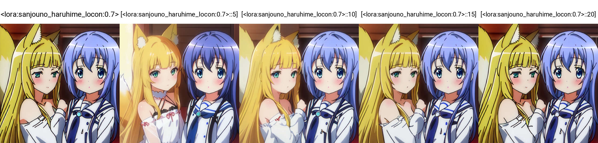
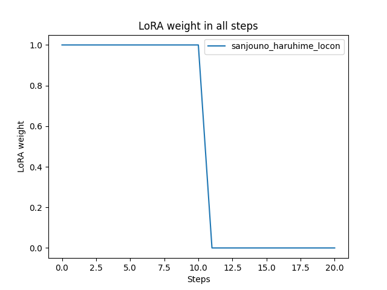
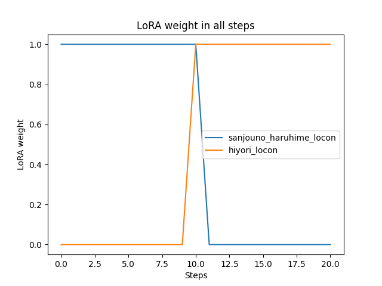
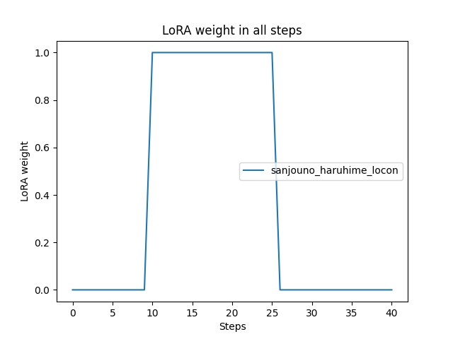
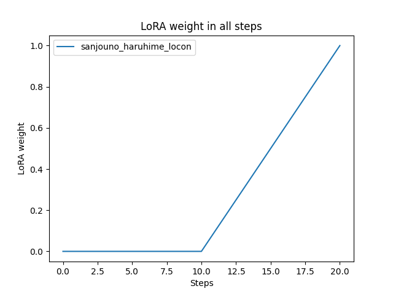
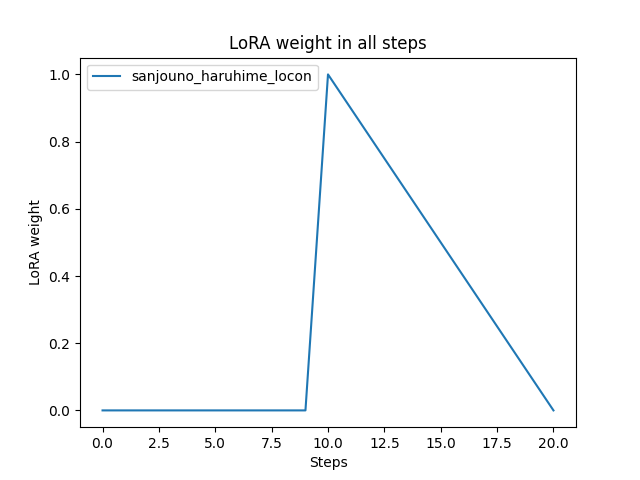
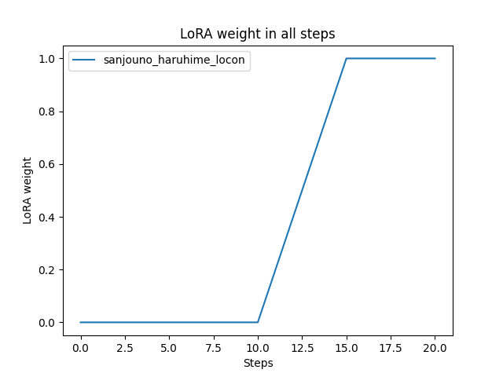
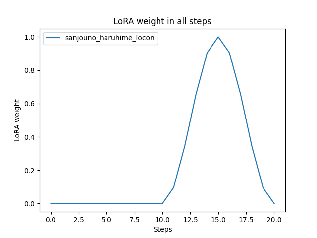
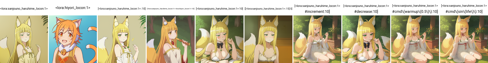
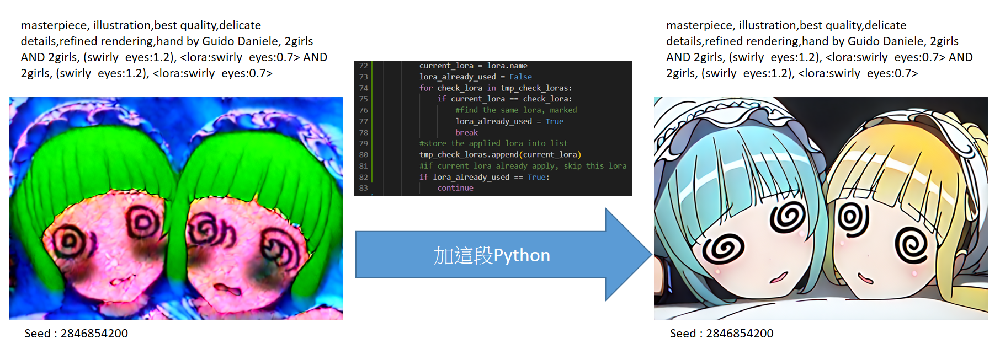

# Composable LoRA/LyCORIS with steps
This extension replaces the built-in LoRA forward procedure and provides support for LoCon and LyCORIS.

This extension is forked from the Composable LoRA extension.

### Language
* [繁體中文](README.zh-tw.md)  
* [简体中文](README.zh-cn.md) (Wikipedia zh converter)
* [日本語](README.ja.md) (ChatGPT)

## Installation
Note: This version of Composable LoRA already includes all the features of the original version of Composable LoRA. You only need to select one to install.

This extension cannot be used simultaneously with the original version of the Composable LoRA extension. Before installation, you must first delete the `stable-diffusion-webui-composable-lora` folder of the original version of the Composable LoRA extension in the `webui\extensions\` directory.

Next, go to \[Extension\] -> \[Install from URL\] in the webui and enter the following URL:
```
https://github.com/a2569875/stable-diffusion-webui-composable-lora.git
```
Install and restart to complete the process.

## Features
### Compatible with Composable-Diffusion
By associating LoRA's insertion position in the prompt with `AND` syntax, LoRA's scope of influence is limited to a specific subprompt.

### Composable with step
By placing LoRA within a prompt in the form of `[A:B:N]`, the scope of LoRA's effect is limited to specific drawing steps.


### LoRA weight controller
Added a syntax `[A #xxx]` to control the weight of LoRA at each drawing step. 
Currently supported options are:
* `decrease`
     - Gradually decrease weight within the effective steps of LoRA until 0.
* `increment`
     - Gradually increase weight from 0 within the effective steps of LoRA.
* `cmd(...)`
     - A customizable weight control command, mainly using Python syntax.
         * Available parameters
             + `weight`
                 * The current weight of LoRA.
             + `life`
                 * A number between 0-1, indicating the current life cycle of LoRA. It is 0 when it is at the starting step and 1 when it is at the final step of this LoRA's effect.
             + `step`
                 * The current step number.
             + `steps`
                 * The total number of steps.
         * Available functions
             + `warmup(x)`
                 * x is a number between 0-1, representing a warmup constant. Calculated based on the total number of steps, the function value gradually increases from 0 to 1 until x is reached.
             + `cooldown(x)`
                 * x is a number between 0-1, representing a cooldown constant. Calculated based on the total number of steps, the function value gradually decreases from 1 to 0 after x.
             + sin, cos, tan, asin, acos, atan
                 * Trigonometric functions with all steps as the period. The values of sin and cos are expected to be between 0 and 1.
             + sinr, cosr, tanr, asinr, acosr, atanr
                 * Trigonometric functions in radians, with a period of 2π.
             + abs, ceil, floor, trunc, fmod, gcd, lcm, perm, comb, gamma, sqrt, cbrt, exp, pow, log, log2, log10
                 * Functions in the math library of Python.
Example :
* `[<lora:A:1>::10]`
     - Use LoRA named A until step 10.
       
* `[<lora:A:1>:<lora:B:1>:10]`
     - Use LoRA named A until step 10, then switch to LoRA named B.
       
* `[<lora:A:1>:10]`
     - Start using LoRA named A from step 10.
* `[<lora:A:1>:0.5]`
     - Start using LoRA named A from 50% of the steps.
* `[[<lora:A:1>::25]:10]`
     - Start using LoRA named A from step 10 until step 25.
       
* `[<lora:A:1> #increment:10]`
     - During the usage of LoRA named A, increment the weight linearly from 0 to the specified weight, starting from step 10.
       
* `[<lora:A:1> #decrease:10]`
     - During the usage of LoRA named A, decrease the weight linearly from 1 to 0, starting from step 10.
       
* `[<lora:A:1> #cmd\(warmup\(0.5\)\):10]`
     - During the usage of LoRA named A, set the weight to the warm-up constant and increase it linearly from 0 to the specified weight until 50% of the LoRA lifecycle is reached, starting from step 10.
     - 
* `[<lora:A:1> #cmd\(sin\(life\)\):10]`
     - During the usage of LoRA named A, set the weight to a sine wave, starting from step 10.
       

All the image:


### Eliminate the impact on negative prompts
With the built-in LoRA, negative prompts are always affected by LoRA. This often has a negative impact on the output.
So this extension offers options to eliminate the negative effects.

## How to use
### Enabled
When checked, Composable LoRA is enabled.

### Composable LoRA with step
Check this option to enable the feature of turning on or off LoRAs at specific steps.

### Use Lora in uc text model encoder
Enable LoRA for uncondition (negative prompt) text model encoder.
With this disabled, you can expect better output.

### Use Lora in uc diffusion model
Enable LoRA for uncondition (negative prompt) diffusion model (denoiser).
With this disabled, you can expect better output.

### plot the LoRA weight in all steps
If "Composable LoRA with step" is enabled, you can select this option to generate a chart that shows the relationship between LoRA weight and the number of steps after the drawing is completed. This allows you to observe the variation of LoRA weight at each step.

## Compatibilities
`--always-batch-cond-uncond` must be enabled  with `--medvram` or `--lowvram`

## Changelog
### 2023-04-02
* Added support for LoCon and LyCORIS
* Fixed error: IndexError: list index out of range
### 2023-04-08
* Allow using the same LoRA in multiple AND blocks
  
### 2023-04-13
* Submitted pull request for the 2023-04-08 version
### 2023-04-19
* Fixed loading extension failure issue when using pytorch 2.0
* Fixed error: RuntimeError: Expected all tensors to be on the same device, but found at least two devices, cuda and cpu! (when checking argument for argument mat2 in method wrapper_CUDA_mm)
### 2023-04-20
* Implemented the function of enabling or disabling LoRA at specific steps
* Improved the algorithm for enabling or disabling LoRA in different AND blocks and steps, by referring to the code of LoCon and LyCORIS extensions
### 2023-04-21
* Implemented the method to control different weights of LoRA at different steps (`[A #xxx]`)
* Plotted a chart of LoRA weight changes at different steps

## Acknowledgements
*  [opparco, Composable LoRA original author](https://github.com/opparco)、[Composable LoRA](https://github.com/opparco/stable-diffusion-webui-composable-lora)
*  [JackEllie's Stable-Siffusion community team](https://discord.gg/TM5d89YNwA) 、 [Youtube channel](https://www.youtube.com/@JackEllie)
*  [Chinese Wikipedia community team](https://discord.gg/77n7vnu)